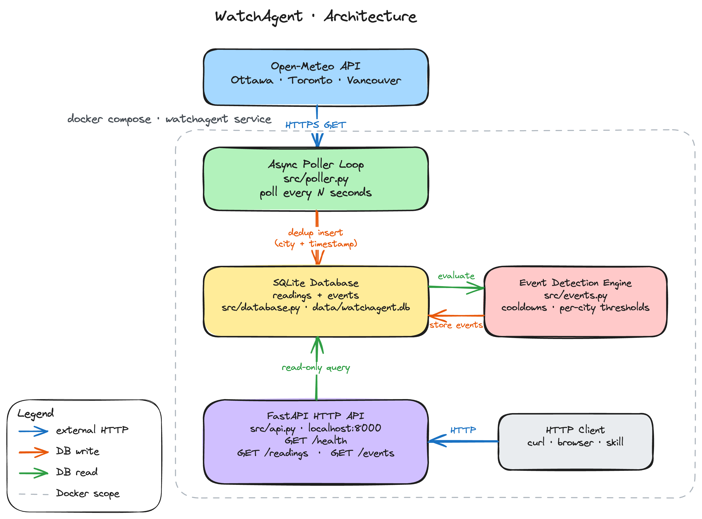

# WatchAgent: Weather Monitor & AI Assistant

WatchAgent polls live weather for Ottawa, Toronto, and Vancouver, stores deduplicated readings, detects notable weather events, and exposes both datasets through a FastAPI HTTP API.

## System Overview

The service is designed around one core question: _what deserves attention_?

- The poller fetches Open-Meteo `current` weather data on a schedule.
- Readings are stored only when the `(city, timestamp)` pair is new.
- New readings are evaluated by an event engine that balances useful sensitivity and noise suppression.
- API endpoints provide recent readings and detected events for monitoring and review.

## Architecture



## Why FastAPI

FastAPI was selected because:

- it has first-class async support, which the background poller and aiosqlite DB calls require natively — Flask would need additional extensions for async
- its automatic query parameter validation (via Pydantic) keeps the `/readings` and `/events` contracts explicit without manual parsing
- it provides fast setup for a small service without the overhead of Django's ORM/admin layer, which this project does not need

## Event Detection Design

### Design philosophy

Infrastructure monitoring is about deciding what matters. The event engine is designed around three principles:

1. **Multi-dimensional signals**: A single threshold check is shallow. Real weather awareness requires combining absolute extremes, rate-of-change, cross-city comparison, city-calibrated baselines, and WMO condition codes.
2. **Noise suppression over sensitivity**: A system that fires constantly is worse than one that fires never — alert fatigue kills monitoring. Every event type has a cooldown window, and temporal signals require minimum history.
3. **Context-aware thresholds**: The same temperature means different things in different cities. Vancouver's maritime climate has a narrow range (7°C anomaly threshold), while Ottawa's continental extremes require a wider band (10°C) to avoid false positives.

### Detection rules (8 event types)

| Event Type | Signal Class | Threshold | Rationale |
|---|---|---|---|
| `RAPID_TEMP_CHANGE` | Temporal + rate | ≥5°C delta AND ≥1.5°C/hr rate within 6h window | Environment Canada issues special weather statements for rapid temperature changes. Rate-based detection avoids false positives from normal diurnal variation. |
| `EXTREME_WIND` | Absolute | ≥60 km/h (warning), ≥90 km/h (critical) | Environment Canada wind warning threshold is 60 km/h for most regions. 90 km/h approaches hurricane-force gusts. |
| `HEAVY_PRECIPITATION` | Absolute | ≥5 mm/hr (warning), ≥15 mm/hr (critical) | 5 mm/hr sustained causes urban drainage stress. 15 mm/hr triggers flash flood risk per EC rainfall warnings. |
| `EXTREME_COLD` | Absolute | Apparent temp ≤-25°C (warning), ≤-35°C (critical) | Frostbite risk begins at -25°C wind chill per Health Canada guidelines. -35°C is "extreme cold" warning level. |
| `EXTREME_HEAT` | Absolute | Apparent temp ≥35°C (warning), ≥40°C (critical) | Ontario heat warning threshold is 31°C humidex sustained; 35°C apparent is conservative. 40°C is dangerous heat. |
| `SEVERE_WEATHER_CODE` | WMO condition | Codes ≥65 (warning), ≥95 (critical) | WMO codes encode conditions (thunderstorms, freezing rain, heavy snow) that warrant advisories regardless of numeric thresholds. Uses the weather_code field that other rules ignore. |
| `CROSS_CITY_TEMP_DIVERGENCE` | Comparative | ≥15°C difference between any two cities | A 15°C spread across cities in the same country at the same time indicates a significant weather boundary (e.g., Arctic front reaching Ottawa but not Vancouver). |
| `CITY_TEMP_ANOMALY` | City-calibrated | Deviation from recent baseline exceeds per-city threshold | Ottawa: 10°C, Toronto: 9°C, Vancouver: 7°C. Vancouver is stricter because its maritime climate rarely deviates; the same threshold would never fire. |

### Noise control strategy

- **Per-event cooldowns** (2–6 hours): Persistent conditions (e.g., a cold snap lasting days) emit once, not every hour. Cooldown is checked against the last event of the same `(city, event_type)` pair.
- **Rate-based temporal detection**: `RAPID_TEMP_CHANGE` requires both absolute magnitude (≥5°C) AND rate (≥1.5°C/hr), preventing false positives from gradual diurnal warming.
- **Minimum history requirements**: Anomaly and temporal rules require 2–4 prior readings before firing, avoiding spurious events on service startup.
- **Graduated severity**: Each event type has info → warning → critical tiers, allowing consumers to filter by urgency.

### Event record shape

Each event stores:

- `city`, `timestamp`, `event_type`, `severity`
- human-readable `description` (what happened and why it was notable)
- JSON `details` (machine-readable supporting values)

## API Reference

### `GET /health`

Returns service status and storage counts.

```bash
curl "http://localhost:8000/health"
```

```json
{ "status": "ok", "readings_stored": 142, "events_stored": 7 }
```

### `GET /readings?city=Ottawa&limit=50`

Returns stored readings, most recent first.

```bash
curl "http://localhost:8000/readings?city=Ottawa&limit=50"
```

```json
{
  "readings": [
    {
      "id": 42, "city": "Ottawa", "timestamp": "2026-05-26T18:00",
      "temperature_2m": 22.5, "apparent_temperature": 20.1,
      "precipitation": 0.0, "wind_speed_10m": 14.3, "weather_code": 2
    }
  ]
}
```

### `GET /events?city=Ottawa&limit=50`

Returns detected events, most recent first.

```bash
curl "http://localhost:8000/events?city=Ottawa&limit=50"
```

```json
{
  "events": [
    {
      "id": 3, "city": "Ottawa", "timestamp": "2026-05-26T14:00",
      "event_type": "RAPID_TEMP_CHANGE", "severity": "info",
      "description": "Temperature rose 6.2°C over recent readings (from 16.3°C to 22.5°C)",
      "details": "{\"delta\": 6.2, \"from\": 16.3, \"to\": 22.5}",
      "created_at": "2026-05-26 14:01:23"
    }
  ]
}
```

## Local Development

### Prerequisites

- Python 3.11+
- Docker + Docker Compose

### Run with Docker (challenge path)

```bash
git clone <your-repo>
cd watchagent
cp .env.example .env
docker compose up --build
```

API will be available at [http://localhost:8000](http://localhost:8000).

### Run without Docker

```bash
python -m venv .venv
source .venv/bin/activate
pip install -r requirements-dev.txt
cp .env.example .env
python main.py
```

## Environment Variables

See `.env.example`:

- `POLL_INTERVAL_SECONDS`: poll interval in seconds
- `DATABASE_PATH`: sqlite db path
- `API_HOST`, `API_PORT`: HTTP bind settings
- `MAX_FETCH_RETRIES`: retries per city fetch before giving up
- `FETCH_TIMEOUT_SECONDS`: HTTP timeout per attempt
- `ENABLE_POLLER`: enables background poller (set `false` in some tests/dev scenarios)

## Tests

Run unit tests:

```bash
pytest -q
```

Run linter:

```bash
ruff check .
```

Coverage focus:

- **Deduplication**: same reading inserted twice stores only one row; poller-level dedup across two poll cycles
- **Event detection (isolated)**: each of the 8 event types tested individually with both positive and false-positive-guard assertions
- **Cooldown**: events suppressed within window, re-fire after expiry
- **Cross-city divergence**: fires on large difference, silent when cities are close
- **Severe weather code**: fires on thunderstorm/snow/freezing rain, silent on clear/mild codes
- **API shape**: `/health`, `/readings`, `/events` return correct structure for seeded data

All tests mock external dependencies by avoiding live Open-Meteo calls.

## CI Pipeline

GitHub Actions workflow (`.github/workflows/ci.yml`) runs on every push to `main` with:

1. **Lint job**: runs `ruff check .` for code quality and import ordering
2. **Test job**: installs dependencies and runs `pytest -q`
3. **Build job**: runs `docker build -t watchagent:ci .`

## Cursor Setup

The repository includes a committed `.cursor/` folder as a graded deliverable.

### Rules

1. `.cursor/rules/poller-failure-logging.mdc`
   - Encodes poller resilience and logging behavior for failed API calls.
   - Prevents fragile implementations that crash on transient upstream errors.

2. `.cursor/rules/event-record-shape.mdc`
   - Enforces event record schema and anti-noise behavior (cooldowns + rationale fields).
   - Keeps event output analyzable and consistent as logic evolves.

3. `.cursor/rules/test-isolation-and-dedup.mdc`
   - Enforces mocked external API usage in unit tests and poll-level dedup coverage.
   - Keeps tests deterministic and aligned to the challenge's dedup expectation.

### Custom Agent

`.cursor/agents/event-signal-reviewer.md`

- Scoped reviewer agent for event logic quality only.
- Helps calibrate signal/noise trade-offs and identify missing false-positive/false-negative tests.

### Skills

1. `.cursor/skills/weather_data_analysis.py` (primary graded skill)
   - Executable data analysis script that queries readings/events from SQLite.
   - Returns structured JSON for trend summaries, city comparison, and event breakdown.
   - Example:
     ```bash
     python .cursor/skills/weather_data_analysis.py --db data/watchagent.db --question "compare city trends and event summary"
     ```

2. `.cursor/skills/replay_event_candidates.py`
   - Replays recent readings to inspect candidate threshold matches.
   - Useful for calibrating event definitions against collected data.

3. `.cursor/skills/weather-data-analyst/SKILL.md`
   - Cursor skill definition that operationalizes the analysis scripts for repeatable agent use.
   - Documents input expectations, output format, and failure handling for empty databases.

## Open-Meteo Source

Data source: [https://api.open-meteo.com/v1/forecast](https://api.open-meteo.com/v1/forecast)  
Cities monitored:

- Ottawa (`45.42`, `-75.69`)
- Toronto (`43.70`, `-79.42`)
- Vancouver (`49.25`, `-123.12`)
